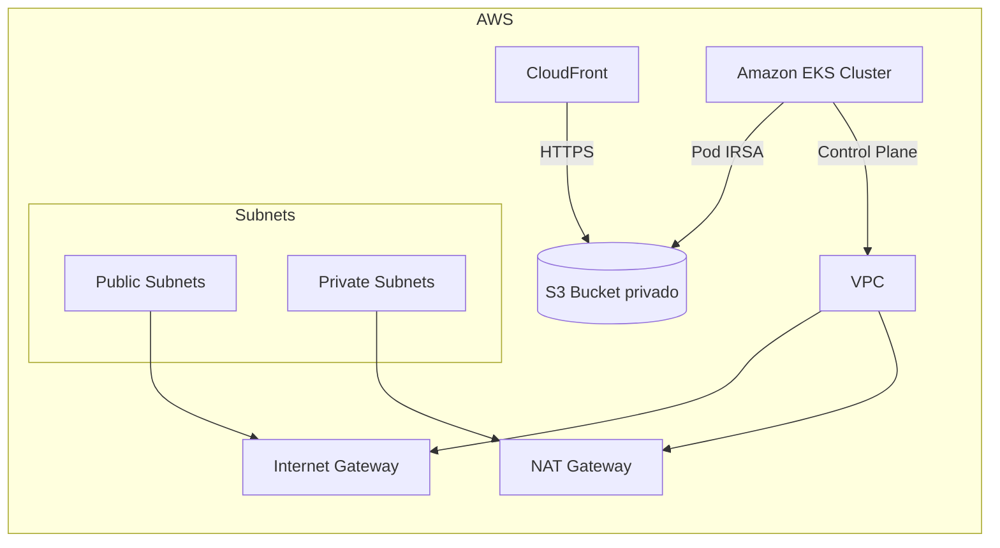

# Infraestrutura de Assets Estáticos e EKS

Projeto Terraform para provisionar uma arquitetura AWS com:
- S3 privado para assets estáticos
- CloudFront como CDN HTTPS com Origin Access Control
- EKS com IRSA para o painel administrativo
- VPC com subnets públicas e privadas, NAT Gateway e Security Groups

## Estrutura do Repositório

- `main.tf` - composição dos módulos
- `providers.tf` - provedores e versão do Terraform
- `backend.tf` - backend remoto comentado
- `variables.tf` / `terraform.tfvars.example` - variáveis do projeto
- `modules/` - módulos Terraform organizados por responsabilidade
- `k8s/` - manifestos Kubernetes de exemplo
- `.github/workflows/terraform.yml` - pipeline básico de PR

## Como executar

1. Copie o arquivo de variáveis locais:

```bash
cp terraform.tfvars.example terraform.tfvars
```

2. Ajuste `terraform.tfvars` para um nome de bucket S3 globalmente único.

3. Inicialize o Terraform:

```bash
terraform init
```

4. Faça o planejamento:

```bash
terraform plan
```

5. Aplique a infraestrutura:

```bash
terraform apply
```

6. Configure o kubeconfig para acessar o cluster EKS:

```bash
aws eks update-kubeconfig --region ${AWS_REGION} --name <cluster_name>
```

> Substitua `<cluster_name>` pelo valor gerado em `module.eks.eks_cluster_name` ou pelo nome configurado em `terraform.tfvars`.

## Decisões Técnicas

- Usei **modularização** para separar VPC, EKS e S3+CloudFront.
- O bucket S3 é privado com **bloqueio de acesso público**, versionamento e criptografia em repouso.
- O CloudFront acessa S3 somente via **Origin Access Control (OAC)**, evitando acesso público direto.
- O EKS foi configurado com **IRSA** (OIDC Provider + ServiceAccount) para conceder apenas o pod administrativo o acesso S3 necessário.
- Os nós do EKS ficam em **subnets privadas** para reduzir exposição direta e forçar saída pela NAT Gateway.
- Adicionei **addons gerenciados** do EKS: `vpc-cni`, `coredns` e `kube-proxy`.

## Arquitetura



## Kubernetes Manifestos de Exemplo

Os arquivos `k8s/serviceaccount.yaml` e `k8s/deployment.yaml` ilustram como o painel administrativo consumiria a ServiceAccount anotada com o ARN da role IRSA.

### Observações

- Atualize `eks.amazonaws.com/role-arn` no `serviceaccount.yaml` com o ARN retornado pelo Terraform.
- Configure `BUCKET_NAME` no Deployment com o bucket S3 criado.

## Melhorias possíveis

- Adicionar **AWS WAF** no CloudFront para proteção adicional.
- Usar **S3 replication** para multi-região e redução de latência global.
- Adicionar **monitoramento** via CloudWatch Alarms e Prometheus/Grafana no cluster.
- Implementar **pipeline de CI/CD** completo com `terraform apply` controlado por revisão e `kubectl apply` para manifests.
- Usar **private hosted zone** ou DNS customizado com ACM para CloudFront.
